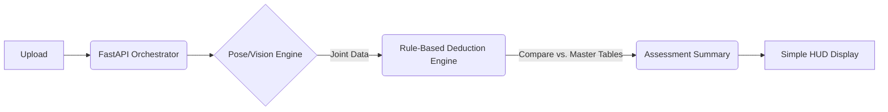

# 🦁 Technical Advisory: Simplifying the Gymnastics Model Service (v1.0)

**Goal**: Transform the complex LLD into a realistic, high-impact MVP that delivers the "Digital Judge" experience without excessive infrastructure overhead.

---

## 🏗️ 1. How to Make Things Simple (The MVP Consolidation)

The current LLD proposes a 5-service microservice architecture. For the initial phase, we should consolidate into a **"Single-Pass Pipeline"** to reduce latency and DevOps complexity.

### ✂️ Consolidation Strategy
| Distributed Service (LLD) | MVP Approach (Simpler) |
| :--- | :--- |
| **Pose Ingestion Service** | **Module A**: Native Python Class within the main API. |
| **Skill Classification Service** | **Module B**: Integrated Model (One-shot classification). |
| **Deduction & Assessment Service**| **Module C**: Rule-Engine (Pure Python math calculations). |
| **Coaching Synthesis Service** | **Module D**: Template-based feedback (LLM only for "Super-Pro" tier). |

> [!TIP]
> **MVP Performance Choice**: Use the **BlazePose GHUM (Heavy)** model directly inside the FastAPI worker. It provides enough fidelity for basic FIG deductions without needing a separate Pose service.

---

## 📊 2. Master Tables: The Source of Truth

To make the app "Smart," we store the judging logic in **Master Tables** rather than hard-coding it into the AI.

### `dim_skill_atlas` (The Rulebook)
| Field | Purpose | Example |
| :--- | :--- | :--- |
| `skill_id` | Unique identifier | `salto_back_tuck` |
| `fig_code` | Official FIG code | `C12.1` |
| `req_logic` | JSON of requirements | `{"min_height": 1.5, "min_rotation": 360}` |
| `base_value` | D-Score contribution | `0.3` |

### `dim_scoring_standards` (The Scaling Table)
| Age Group | $C_s$ Multiplier | Voice Tone |
| :--- | :--- | :--- |
| **U10** | `0.50` | Playful |
| **U14** | `0.75` | Instructional |
| **Senior** | `1.00` | Professional |

### `dim_fault_map` (The Penalty Logic)
Contains thresholds for Small, Medium, and Large deductions for every category.

---

## ⚡ 3. Easy Model Extraction (The "Low-Hanging Fruit")

Here is the data we can get from the vision models with almost zero custom training:

1.  **Skeleton Joint Angles**: Using standard trigonometry on x,y,z coordinates (e.g., knee bend, leg separation).
2.  **Apex Detection**: The frame where the Center of Mass (COM) vertical velocity ($V_y$) switches from positive to negative.
3.  **Hold Verification**: The duration where joint velocity is below a threshold (e.g., $V < 0.05$ m/s for 2 seconds).
4.  **Landing Impact**: Detecting the sharp deceleration spike when the feet contact the floor.

---

## 🚀 4. Recommended Data Flow (Simplified)

### Recommendation:
Start by populating the **Master Tables** for 5 core skills. This creates a "Manual Judge" that users can trust, while the Deep Learning models (Skill ID) can be added as an enhancement later.
