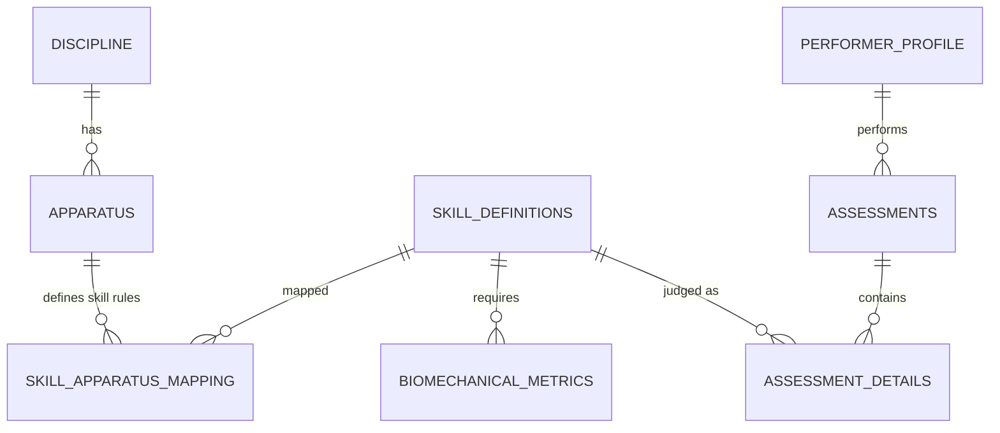

# 🦁 Gymnastics Model Service: Database Architecture (v1.0)

**Role**: Database Architect
**Objective**: Build a high-performance relational schema that serves as the "Rulebook Brain" for the Model Service 2.0.

---

## 🏗️ 1. Entity Relationship Overview

The schema is designed to separate **Canonical Skill Data** from **Apparatus-Specific Logic** and **Biomechanical Thresholds**.



---

## 💾 2. SQL Schema Definition

### 2.1 Core Metadata (Disciplines & Apparatus)
```sql
CREATE TABLE disciplines (
    discipline_id SERIAL PRIMARY KEY,
    name VARCHAR(50) UNIQUE NOT NULL, -- Artistic, Rhythmic, Trampoline
    description TEXT
);

CREATE TABLE apparatus (
    apparatus_id SERIAL PRIMARY KEY,
    discipline_id INT REFERENCES disciplines(discipline_id),
    name VARCHAR(50) NOT NULL, -- Floor, Vault, Pommel Horse
    category VARCHAR(20) -- MAG, WAG, Both
);
```

### 2.2 Skill Atlas (The Rulebook)
```sql
-- Updated Skill Definitions from User Draft
CREATE TABLE skill_definitions (
    skill_id UUID PRIMARY KEY DEFAULT gen_random_uuid(),
    canonical_name VARCHAR(100) NOT NULL,
    skill_type VARCHAR(50), -- Static, Rotational, Acro, Dance
    element_group INT, -- Group I, II, III, IV
    difficulty_letter CHAR(1), -- A, B, C, D, E...
    fig_value DECIMAL(3,2), -- 0.1 to 1.0 (D-Score contribution)
    video_ref_url TEXT
);

-- Linking Skills to Apparatus with Contextual Logic
CREATE TABLE skill_apparatus_mapping (
    mapping_id SERIAL PRIMARY KEY,
    skill_id UUID REFERENCES skill_definitions(skill_id),
    apparatus_id INT REFERENCES apparatus(apparatus_id),
    discipline_code VARCHAR(10), -- WAG, MAG
    unique_deductions JSONB, -- Specific FIG variations for this apparatus
    technical_requirements JSONB -- Mandatory criteria for recognition
);
```

### 2.3 The "Digital Judge" Constants (Biometrics & Scaling)
```sql
-- Advanced Metrics for Biomechanical Analysis
CREATE TABLE biomechanical_thresholds (
    threshold_id SERIAL PRIMARY KEY,
    skill_id UUID REFERENCES skill_definitions(skill_id),
    metric_type VARCHAR(50), -- 'Angle_Leg_Sep', 'Velocity_Rotation', 'Hold_Duration'
    min_threshold DECIMAL,
    max_threshold DECIMAL,
    unit VARCHAR(10), -- deg, ms, m/s
    severity_tier VARCHAR(10) -- Small, Medium, Large
);

-- Age-Group Scaling Constants (The $C_s$ Table)
CREATE TABLE scoring_standards (
    standard_id SERIAL PRIMARY KEY,
    category_label VARCHAR(10) UNIQUE, -- U10, U14, Senior
    scaling_coefficient DECIMAL(3,2), -- 0.50, 0.75, 1.00
    tone_modifier VARCHAR(20) -- Playful, Instructional, Professional
);
```

### 2.4 Transactional Logging (Assessments)
```sql
CREATE TABLE assessments (
    assessment_id UUID PRIMARY KEY DEFAULT gen_random_uuid(),
    performer_id INT, -- Link to user profile
    apparatus_id INT REFERENCES apparatus(apparatus_id),
    overall_e_score DECIMAL(4,2),
    timestamp TIMESTAMPTZ DEFAULT NOW(),
    raw_landmarks_url TEXT -- Link to S3/Blob storage JSON
);

CREATE TABLE assessment_details (
    detail_id SERIAL PRIMARY KEY,
    assessment_id UUID REFERENCES assessments(assessment_id),
    skill_id UUID REFERENCES skill_definitions(skill_id),
    intent_detected VARCHAR(100),
    outcome_status VARCHAR(50), -- Credited, Not Credited
    execution_deduction DECIMAL(3,2),
    coaching_headline TEXT,
    detailed_faults JSONB -- Array of [Bent Knee, Frame 45, -0.1]
);
```

---

## ⚡ 3. Architectural Highlights

1.  **JSONB for Flexibility**: Instead of 50 columns for different rules, `unique_deductions` and `technical_requirements` use JSONB. This allows the API to add new apparatus-specific rules without a schema migration.
2.  **Referential Integrity**: Every assessment is hard-linked to the **Canonical Skill**, ensuring that historical data remains accurate even if the FIG value changes (via a `valid_from/to` pattern if needed later).
3.  **Audit Trail**: The `assessment_details` table stores the "Coaching Headline" generated at the time of the scan, preserving the "Motivational Tone" even if the system logic is updated later.

---
> [!IMPORTANT]
> **DB Implementation Tip**: Use **PostGIS** if we eventually want to store 3D spatial joint coordinates in-database for heat-map queries. 🦁📊
