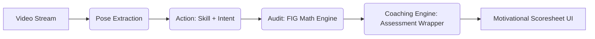

# 🦁 Next-Level Gymnastics Model Service: Modular Architecture (v2.0)

**Objective**: Transition from basic pose tracking to a "Digital Judge" capable of scoring routines with elite precision while delivering **motivational, score-jump coaching**.

---

## 🏗️ 1. The Modular Stack (The Pipeline)

*   **Layer 1 (Pose)**: Pixels -> Normalized Skeleton.
*   **Layer 2 (Intent)**: Intent Resolution (e.g., Switch vs. Split) + Skill Classification.
*   **Layer 3 (The Coaching Engine)**: FIG Math -> **The Digital Scoresheet**.

---

## � 2. The Digital Scoresheet (Assessment Schema)

To build trust and motivation, the API output is designed as a professional "Assessment" (rather than a harsh "Judgement").

### 2.1 Schema Logic: Feedback Prioritization
1.  **Headline**: Motivational and skill-specific (e.g., "Incredible height on that vault!").
2.  **Assessment Score ($E_{score}$)**: Clean, realistic execution score based on FIG math.
3.  **Top Opportunities (Capped at 2)**: Actionable "Score Jumps" (e.g., "Lock knees for +0.3").
4.  **Strength Area**: Recognition of a "Hit" element.
5.  **Realism Check**: Transparency on which rule-set (U10, Senior, etc.) was applied.

---

## 🎭 3. Dynamic Tone Modifier ("Same Data, Different Voice")

| Age Group | Target Voice | Example Content |
| :--- | :--- | :--- |
| **U10** | **Playful & Fun** | "Super job! 🤸 Can you point your toes to unlock a score boost?" |
| **U14** | **Instructional** | "Good form. Squeeze your quads to lock those knees at the apex." |
| **Senior** | **Professional** | "Requirement met. Deduct 0.3 for knee extension deviation." |

---

## 🌟 4. API Output: `v2.6` (The Assessment)

```json
{
  "assessment": {
    "headline": "Great focus! Your handstand was perfectly vertical. ✔️",
    "e_score": 8.7,
    "top_opportunities": [
      {
        "fix": "Focus on quad squeeze during takeoff",
        "potential_gain": "+0.3",
        "coaching_cue": "Lock those knees to jump your score!"
      }
    ],
    "strength": "Clean landing with zero weight shift detected!",
    "realism_check": "Scored using U14 Intermediate FIG Scaling ($C_s = 0.75$).",
    "voice_mode": "instructional"
  }
}
```

---

## ⚖️ 5. Comprehensive FIG Execution Deduction Table

| Fault Category | Metric / Description | Small (0.1) | Medium (0.3) | Large (0.5) |
| :--- | :--- | :--- | :--- | :--- |
| **Bent Arms/Legs** | Angle deviation | 5° - 15° | 16° - 45° | > 45° |
| **Alignment** | Collinearity off | 5° - 10° off | 11° - 20° off | > 20° off |

---

## 📉 6. Scaling Factor Algorithm ($C_s$)

$$Deduction_{Final} = Deduction_{FIG} \times C_s(Age)$$

---

## ⚡ 7. Asynchronous Workflow


